### Brief introduction
- CAFU is a Galaxy-based bioinformatics framework for comprehensive assembly and functional annotation of unmapped RNA-seq data from single- and mixed-species samples which integrates plenty of existing next-generation sequencing (NGS) analytical tools and our developed programs, and features an easy-to-use interface to manage, manipulate and most importantly, explore large-scale unmapped reads. Besides the common process of reads cleansing and mapping, unmapped reads extraction and *de novo* transcription assembly, CAFU optionally offers multiple-level evidence evaluation, sequence and expression characterization, and transcript function annotation. Taking advantages of machine learning (ML) technologies, CAFU also effectively addresses the challenge of classifying species-specific transcripts assembled using unmapped reads from mixed-species samples. The CAFU project is hosted on GitHub(https:/github.com/cma2015/CAFU) and can be accessed from http:/bioinfo.nwafu.edu.cn:4001. In addition, in order to enable large-scale analysis, we also provided a standardized Docker image: [CAFU Docker image](https:/hub.docker.com/r/malab/cafu/).


### CAFU Docker image installation
- Step 1: [Docker installation](Docker_installation.md)
- Step 2: CAFU installation from Docker Hub
  ```bash
  # Pull latest version of CAFU from Docker Hub
  $ docker pull malab/cafu
  ```
- Step 3: Qucikly start
  ```bash
  $ docker run -it -p 80:80 malab/cafu bash
  $ cd /home/galaxy
  $ bash run.sh
  ```
  Then you can access CAFU instance via http:/localhost:80
  
  **Note:** Before running docker, Windows or Mac OS users would better configure some options such as **CPUs**, **Memory**, and **Swap** through the whale in the top status bar (for Mac OS). (see figure below)
  
  

### Upload data

#### Download CAFU test data
- Download test data from [CAFU GitHub project](https:/github.com/cma2015/CAFU). Click **Clone or download** (see figure below), and download the ZIP compressed files into your local device and then uncompress it. 

  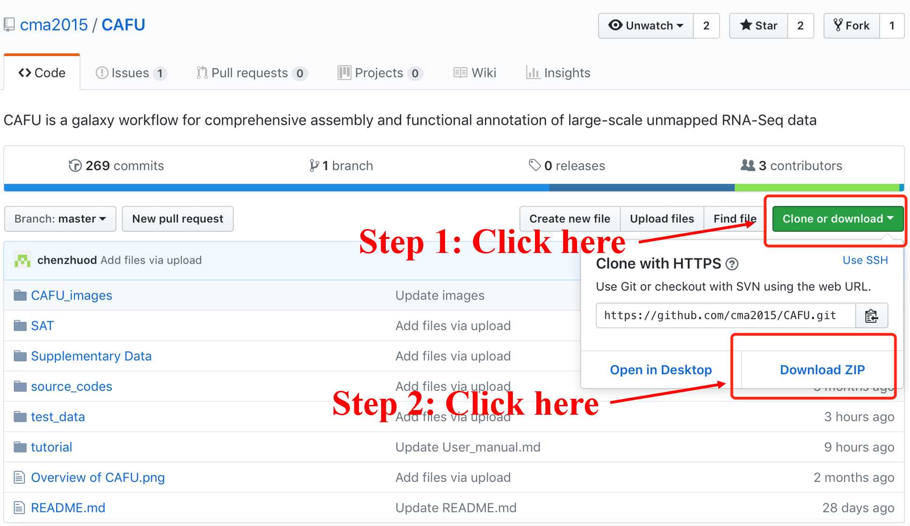


- For users who installed [Git](https:/gist.github.com/derhuerst/1b15ff4652a867391f03), the following command can be used to download CAFU project to local device.
  ```bash
  git clone https://github.com/cma2015/CAFU.git
  ```
#### Upload regular file
- Click **Get Data** in the homepage (see figure below) of CAFU to upload files.


  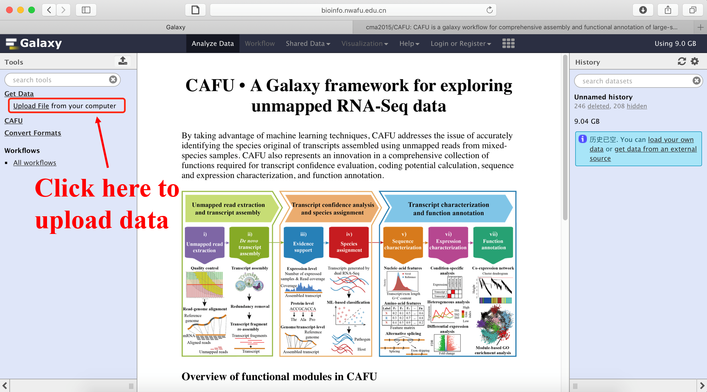


  And then you will see the following interface:

  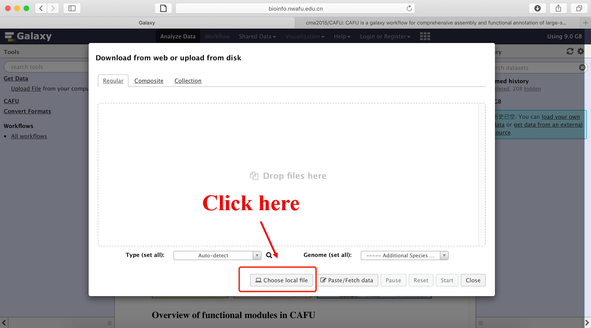


  Next, Click the button **Choose local file** and select a file you would like to upload (e.g. upload the file ```mapping_info``` in the directory ```/your directory/CAFU/test_data/SE RNA-Seq/```), you will see the following interface:

  
  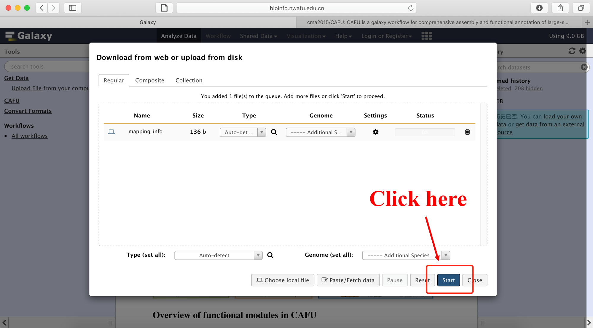

  
  Then click **Start** to upload file.

#### Upload a collection
- Similar to **Upload regular file**, click **Get Data** first (see figure below):


  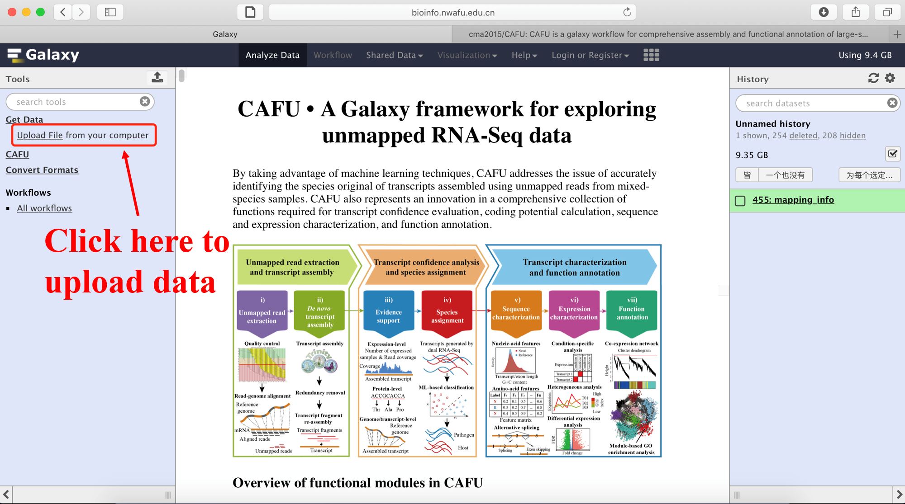

  
  And then you will see the following interface:
  
  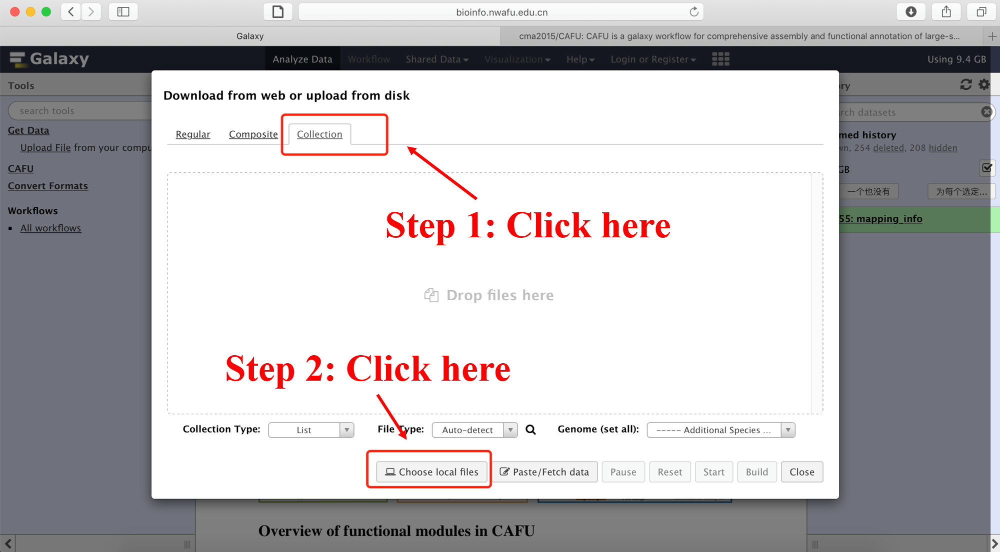

  
  Afterwards, select a list files to upload as a collection (e.g. upload all files with ZIP suffix in the folder ```/your directory/CAFU/test_data/SE RNA-Seq/```):
  
  **Note:** A collcetion also permits one file.

  
  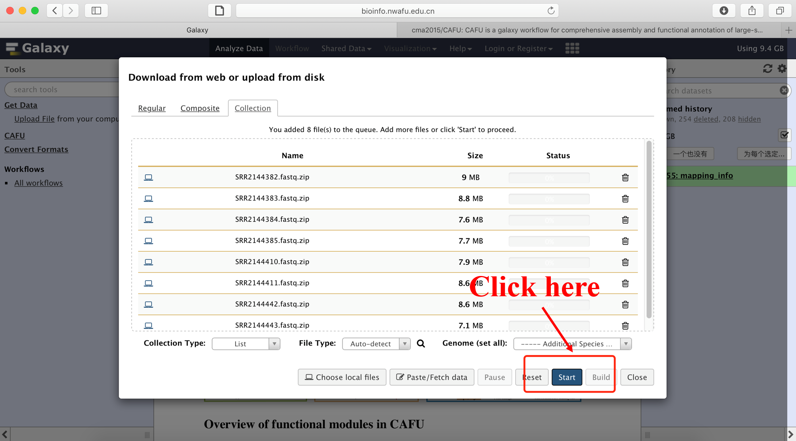


  Click **Start** to upload, after finishing uploading, click **Build** (see figure below):

  
  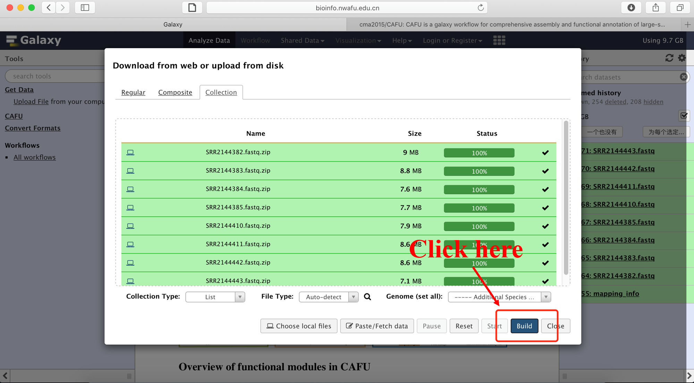

  
  Then enter a name for your collection and click **Create list** to finish.

  
  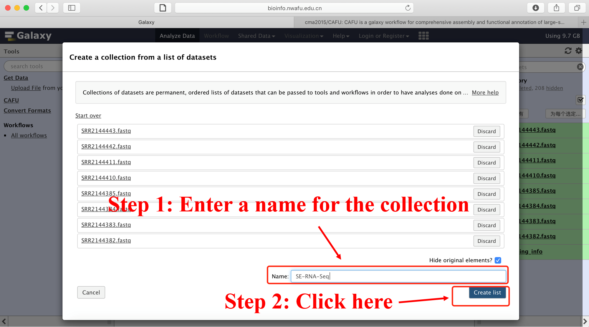


### UNMAPPED READ EXTRACTION
In this module, we provide an example for each function to show how to perform unmapped reads extraction.
- **Quality control**

  In this function, we implemented FastQC (Andrews *et al*., 2010) to enable users to perform quality control on RNA-Seq data. In this tutorial, we will use a list of single-end RNA-Seq collection file (located in the folder ```/your directory/CAFU/test_data/SE RNA-Seq/```) to perform quality control.
  
  To run this function correctly, upload the files in the folder ```/your directory/CAFU/test_data/SE RNA-Seq/``` with **ZIP** suffix as a collection named as ```SE-RNA-Seq```（see section **Upload a collection** to see how to upload a list of RNA-Seq datasets as a collection).

  
  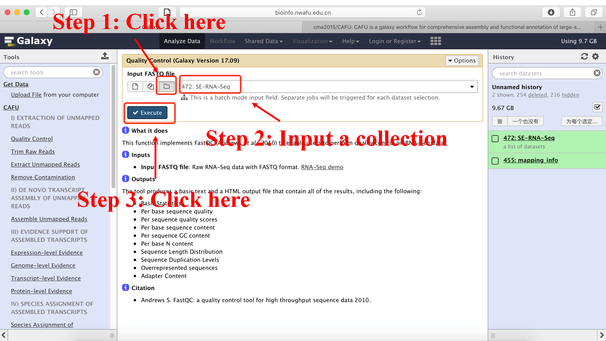

  
  Finally, click **Execute** to start performing quality control.
  Once the analysis is finished, a basic text (RawData) and a HTML output file (Webpage) will be returned. The HTML output contains:

  - Basic Statistics
  - Per base sequence quality
  - Per sequence quality scores
  - Per base sequence content
  - Per sequence GC content
  - Per base N content
  - Sequence Length Distribution
  - Sequence Duplication Levels
  - Overrepresented sequences
  - Adapter Content

  You can access the output by click results in the history pannel (see figure below).


  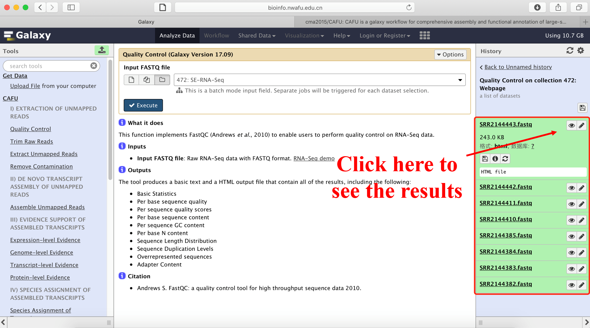


- **Trim raw reads**

  In this function, poly-A/T is firstly trimmmed using fqtrim (Pertea, 2015), and then high-quality reads (e.g. score > 20) are retained by Trimmomatic (Bolger et al., 2014). The reads shorter than 20bp (in default) are discarded. 
  
  Here, we used the same collection (```SE-RNA-Seq```) with last step (**Quality control**) to trim raw reads.


  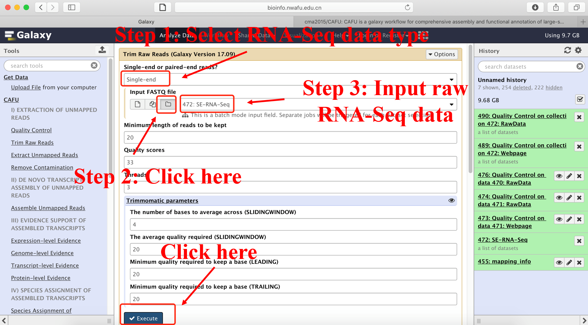


  For each FASTQ formatted file, CAFU returns two outputs as collections including:

  - ```fqtrim_DATA_ID.fastq```: poly-A/T trimmed RNA-Seq using fqtrim (fqtrim_SRR2144443.fastq in this example).

  - ```Trimmed_DATA_ID.fastq```: High-quality RNA-Seq generated by Trimmomatic (Trimmed_SRR2144443.fastq in this example).
  
 You can access the output by click results in the history pannel (see figure below).
 
 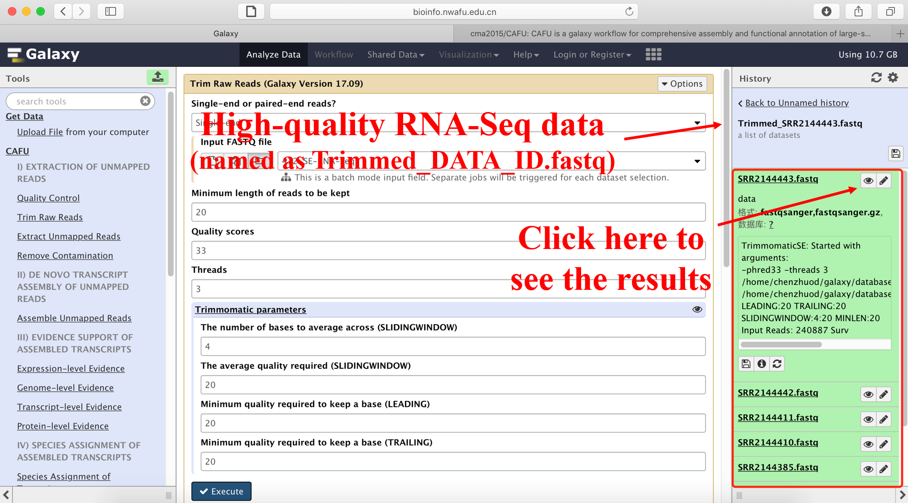
 

- **Extract Unmapped Reads**

  This function integrates several bioinformatic softwares including HISAT2 (Kim et al., 2015), SAMTools (Li et al., 2009), and BEDTools (Quinlan et al., 2010) to extract unmapped reads. Firstly, HISAT2 is used to align user-defined high-quality reads to reference genome. Secondly, SAMTools is used to extract unmapped alignments in SAM format from alignments generated by HISAT2 with parameter "-f 4" and converts SAM format to BAM format. Finally, BEDTools is used to convert the unmapped alignments in BAM format to FASTQ format. In addition, CAFU also supports dual RNA-Seq analysis by aligning RNA-Seq data to multiple reference genomes.

  To run this function, three inputs (see figure below) are required.
 
  **Inputs description:**
  
  **Input 1:** A **collection** of reference genome. Upload files (```maize.fa.zip```) in directory ```/your directory/CAFU/test_data/genomes/``` as a collection named as ```Ref_Genome``` (user-defined name). See section **Upload a collection** to learn how to upload a collection.
  
  **Input 2:** A **collection** of trimmed single-end RNA-Seq files (```Trimmed_SRR2144443.fastq```) generated from **Trim Raw Reads**.
  
  **Input 3:** A **regular** file containing mapping-operation information. Upload the file in directory ```/your directory/CAFU/test_data/SE RNA-Seq/mapping_info``` as a regular file.
  
  **Note:** **Input 3** is a semicolon seperated matrix which contains two columns. The first column contains RNA-Seq ID in each experiment. The second column is the corresponding reference genome ID for each experiment.
  ```bash
  SRR2144382;maize
  SRR2144383;maize
  SRR2144384;maize
  SRR2144385;maize
  SRR2144410;maize
  SRR2144411;maize
  SRR2144442;maize
  SRR2144443;maize
  ```
 
  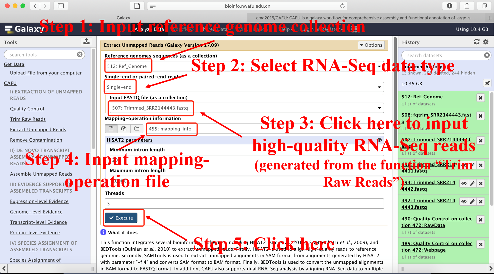


  Then click **Execute** to start extracting unmapped reads using CAFU. After finishing this process, the final unmapped reads named as ```all_unmapped_reads.fastq``` and the number of unmapped reads per experiment named as ```Status_of_number_of_unmapped_reads``` (see figure below) will be returned.


  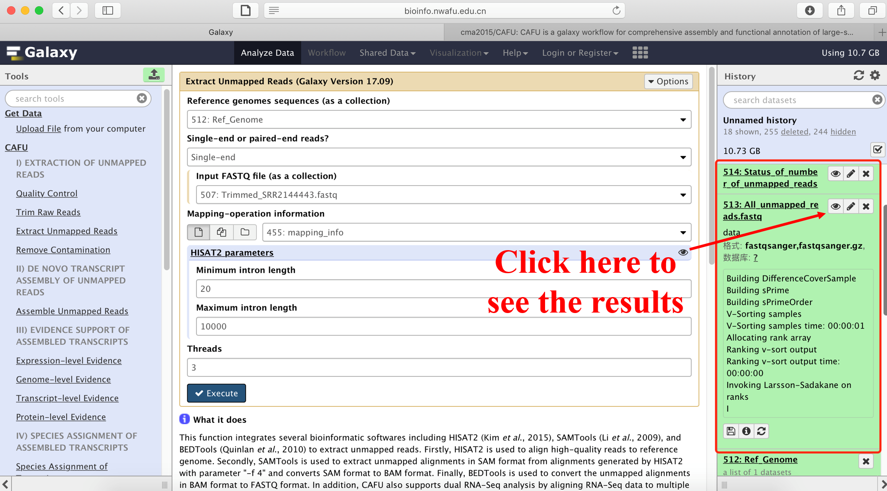


- **Remove Contamination**

  As unmapped reads may result from contamination during sampling or RNA-Seq. In this function, potential contamination sequences are removed using Deconseq (Schmieder *et al*., 2011) with user-defined coverage and identity (e.g., 95) by aligning unmapped reads generated from the function Extract Unmapped Reads to a contamination database.
  
  In the current version of CAFU, users can submit a file of customized contamination reference genome sequences to CAFU to generate a contamination database. Besides, we also provide a default contamination database contains 3,529 bacterial and 81 viral reference genomes (downloaded from NCBI on 2018/11/05).

  Here we use the ```Customized contamination database and single-end unmapped reads``` as an example (see figure below):
  
  **Input 1:** A **regular** file of contamination sequences. Upload files (```Cont_seq.fasta```) in directory ```/your directory/CAFU/test_data/others/``` as a regular file.
  
  **Input 2:** A **regular** file of unmapped reads ```all_unmapped_reads.fastq``` generated from the last step **Extract Unmapped Reads**.

  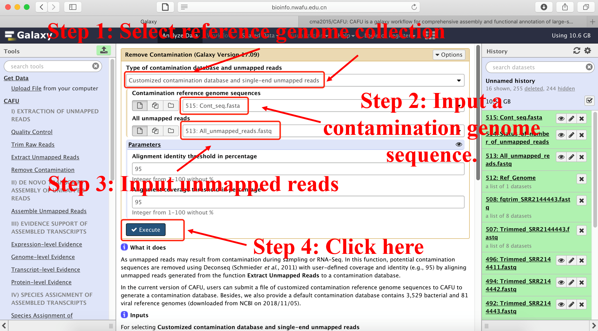

  Click **Execute**, and then the clean reads with FASTQ format ```Clean_unmapped_reads.fastq``` will be returned (see figure below).
  
  

  

###  *DE NOVO* TRANSCRIPT ASSEMBLY OF UNMAPPED READS
- **Assemble Unmapped Reads**

  In this function, three steps including ***de novo* assembly of unmapped reads**, **reducing redundancy of transcript fragments**, and **re-assembly transcript fragments** will be sequentially performed to assemble unmapped reads. In this tutorial, we will use the unmapped reads generated from the function ```Extract Unmapped Reads``` as the input (see figure below).

  
  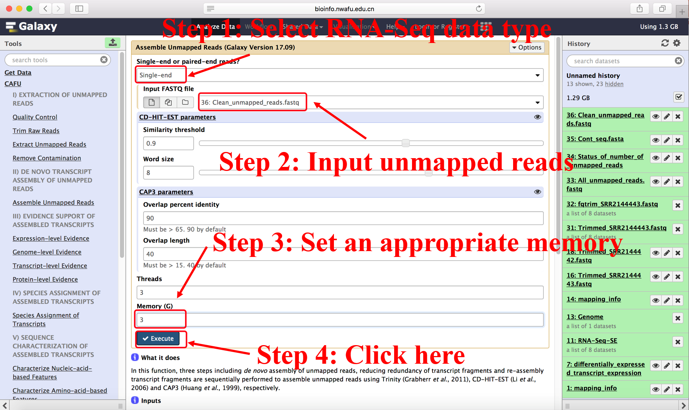
  

  Then assembled transcripts named as ```Unmapped_reads_de_novo_assembled_transcripts```  will be returned (see figure below).


  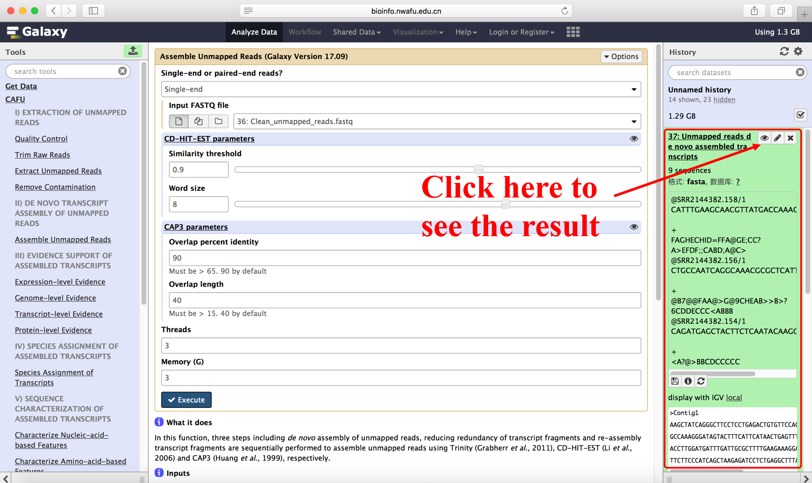


### EVIDENCE SUPPORT OF ASSEMBLED TRANSCRIPTS
- **Expression-level Evidence**

  This function allows users to eliminate assembled transcripts with low read coverage and/or low expression abundance, which are likely assembly artifacts. RNA-Seq reads used for **Assemble Unmapped Reads** are mapped with newly assembled transcripts or/and reference transcripts by using bowtie2 (Langmead *et al*., 2012). CAFU calculates the read coverage of assembled transcripts at single-base resolution using BEDTools (Quinlan et al., 2010), and estimates the expression abundance of all transcripts in terms of FPKM (Fragments Per Kilobase Million) using RSEM (Li *et al*., 2011). Assembled transcripts with low read coverage (e.g., less than 10) and/or low expression (e.g., FPKM less than 1) in the majority of samples (e.g., 80%) are discarded.

  **NOTE:** RNA-Seq for calculating expression abundance and read coverage of transcripts are used the data used in *de novo* assembly. Thus, users only require to input the newly assembled transcripts from unmapped reads (generated from the function **Assemble Unmapped Reads**) or/and reference transcripts with FASTA format. 
  
  In this tutorial, we will use the assembled transcripts ```Unmapped_reads_de_novo_assembled_transcripts``` generated from the function ```Assemble Unmapped Reads``` as the input (see figure below).

  
  
  
  Then three files will be returned (see figure below):
  
  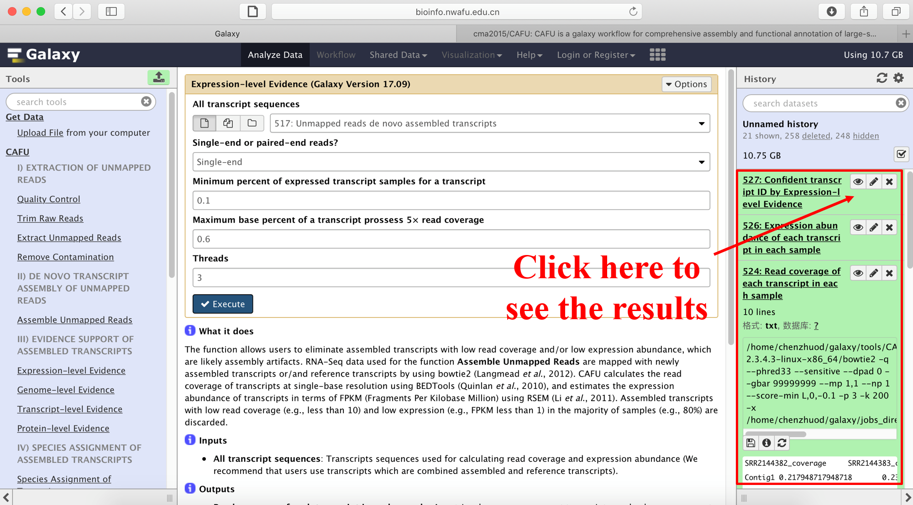
  
  **Output 1**: ```Read coverage of each transcript in each sample```, a matrix whose rows represent transcripts, and columns represent read coverage.

  **Output 2**: ```Expression abundance of each transcript in each sample```, a matrix whose rows represent transcripts, and columns represent expression abundance.

  **Output 3**: ```Confident transcript ID by Expression-level Evidence```, IDs of confident transcripts filtered by both read coverage and expression abundance results.


- **Genome-level Evidence**
  
  This function can be used to identify *de novo*-assembled transcripts missing from the existing genome annotation. All the assembled transcripts are aligned to the reference genome sequences of the species of interests using GMAP (Wu *et al*., 2005), and the best genomic matches with high identity (e.g., ≥ 95%) and coverage (e.g., ≥ 95%) are selected. Users can also eliminate assembled transcripts with no introns, which could represent either noise or pseudogenes.
  
  To run this function, four inputs are required including:

  **Input 1**: A **collection** of reference genome sequences of the species of interest. Upload files (```maize.fa.zip, Oryza.fa.zip, Sorghum.fa.zip```) in directory ```/your directory/CAFU/test_data/genomes/``` as a collection named as ```Ref_Genome``` (user-defined name).

  **Input 2**: A **regular** file of assembled transcript sequences generated from function **Assemble Unmapped Reads**. Test data (```assembled_transcript.fasta```) is in directory ```/your directory/CAFU/test_data/others/```.

  **Input 3**: A **regular** file of genome annotation (GFF format) of corresponding species with RNA-Seq samples. Upload the file (```maize.gff3.zip```) in directory ```/your directory/CAFU/test_data/genomes/```.

  **Input 4**: A character indicating the reference genome name (e.g. maize).


  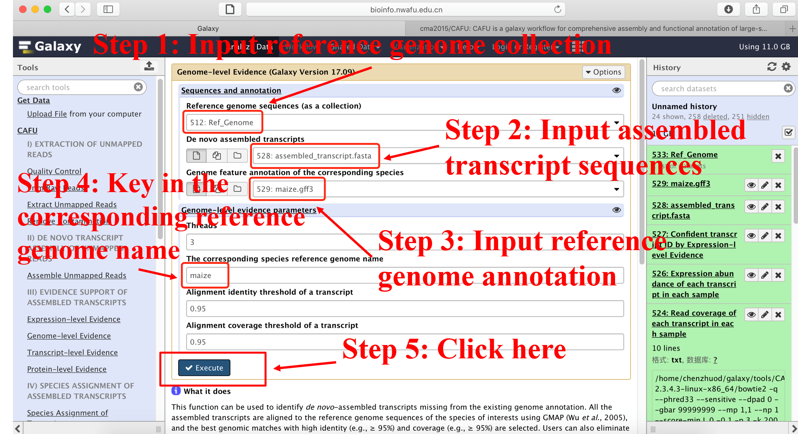


  Then four outputs will be returned (see figure below):
  
  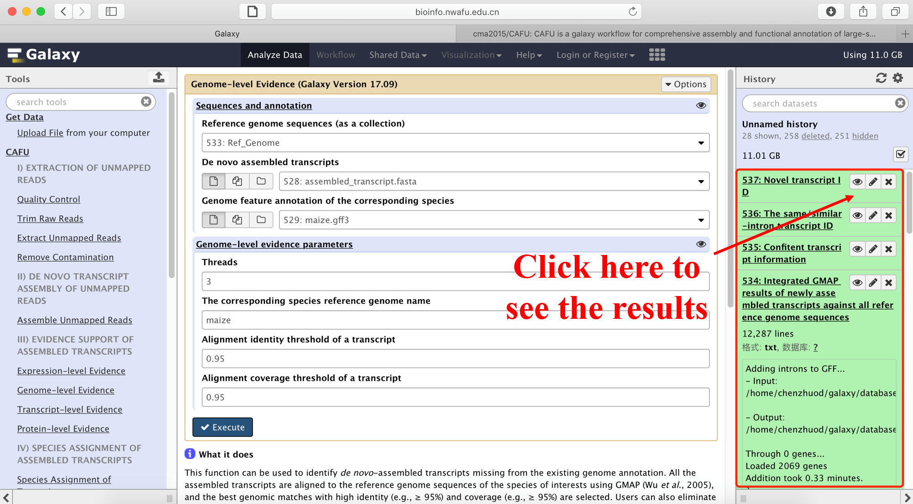

  **Output 1**: ```Integrated GMAP results of newly assembled transcripts against all reference genome sequences```: GMAP alignment results (coverage and identity) of each assembled transcript against all reference genome sequences.

  **Output 2**: ```Confident transcript information```: Confident transcript information filtered by high coverage and identity.

  **Output 3**: ```The same/similar-intron transcript ID```: Assembled transcript IDs which possess the same/similar intron with corresponding species reference transcripts.

  **Output 4**: ```Novel transcript ID```: IDs of novel transcripts missing in the existing genome annotation.

- **Transcript-level Evidence**

  This function can be used to select assembled transcripts with high similarity comparing to other well-annotated transcripts, such as full-length transcripts generated from single-molecule real-time sequencing and/or high-quality transcripts annotated in closely related species. After aligning assembled transcripts with other well-annotated transcripts with GAMP (Wu *et al*., 2005), CAFU outputs the best transcript alignments with high identity (e.g., ≥ 95%) and coverage (e.g., ≥ 95%).
  
  To run this function, at least two inputs are required including:

  **Input 1**: A **collection** of reference sequence of well-annotated transcripts, such as full-length transcripts generated from single-molecule real-time sequencing and/or high-quality transcripts annotated in closely related species. Upload files (```ref_trans.fasta.zip, ref_trans_1.fasta.zip```) in directory ```/your directory/CAFU/test_data/Transcripts/``` as a collection named as ```Well-annotated transcript sequences``` (user-defined name).

  **Input 2**: A **regular** file of assembled transcript sequences generated from the function **Assemble Unmapped Reads**. Test data (```assembled_transcript.fasta```) is in directory ```/your directory/CAFU/test_data/others/```.


   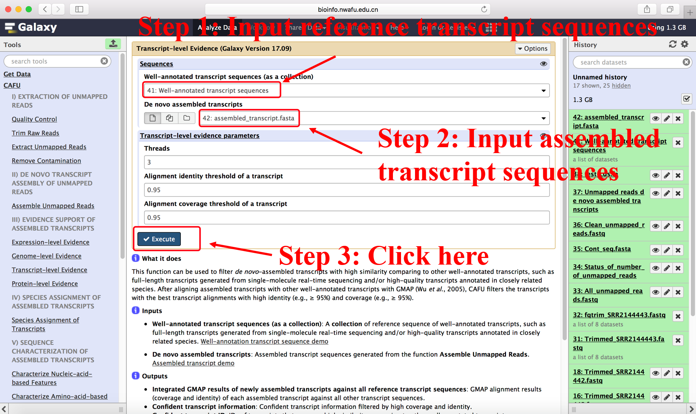 

   
   Then three outputs will be returned (see figure below):
   
   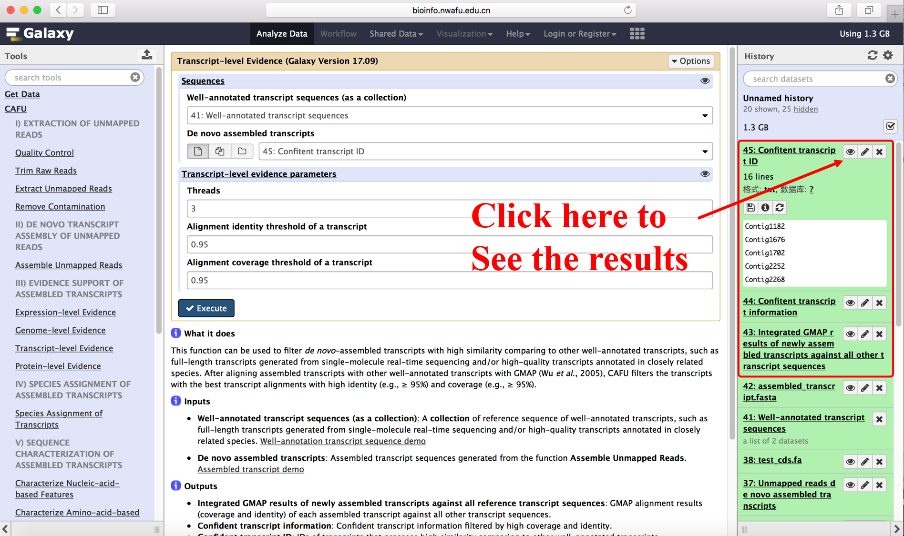
   
   **Output 1**: ```Integrated GMAP results of newly assembled transcripts against all reference transcript sequences```, GMAP alignment results (coverage and identity) of each assembled transcript against all other well-annotated transcripts.

   **Output 2**: ```Confident transcript information```, Confident transcript information filtered by high coverage and identity.

   **Output 3**: ```Confident transcript ID```, IDs of transcripts that prossess high similarity comparing to other well-annotated transcripts.

- **Protein-level Evidence**

  In this function, coding potential evidence of transcripts is fistly evaluated using CPC2 (Kang *et al*., 2017). Then for coding transcripts, Pfam (Finn *et al*., 2014) will be used to identify putative domains of corresponding protein. 
  
  Here, we use the assembled transcripts ```Unmapped_reads_de_novo_assembled_transcripts``` generated from the function ```Assemble Unmapped Reads``` as the input (see figure below).

  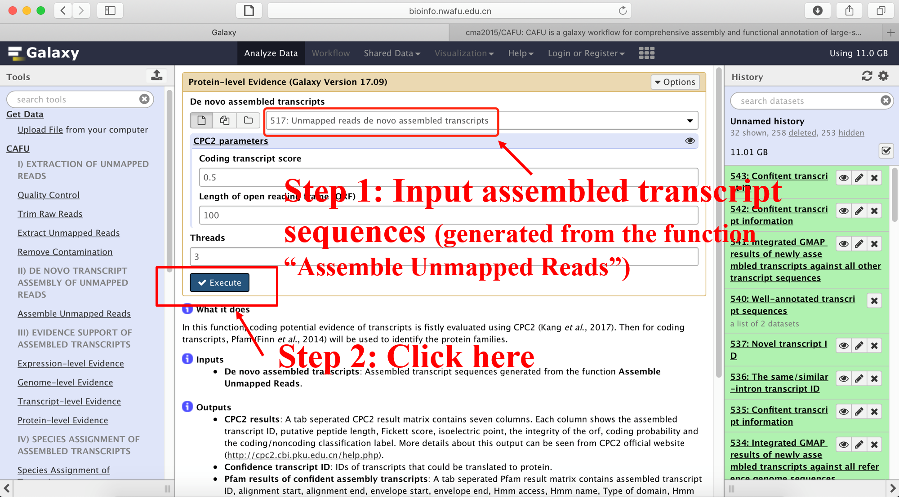 

  Then three outputs will be returned (see figure below):
  
  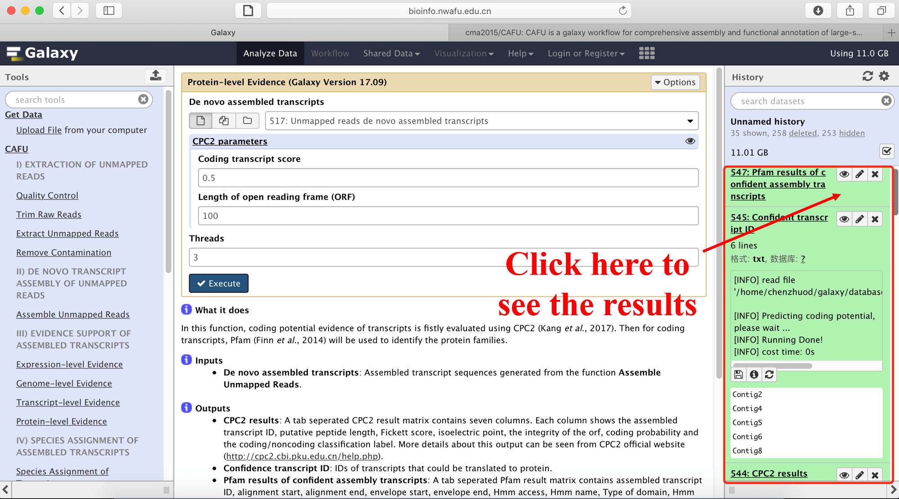 

  **Output 1**: ```CPC2 output```, A tab seperated CPC2 output matrix contains seven columns. Each column shows the sequence ID, putative peptide length, Fickett score, isoelectric point, the integrity of the orf, coding probability and the coding/noncoding classification label. More details about this output can be seen from [CPC2 official website](http:/cpc2.cbi.pku.edu.cn/help.php). 

  **Output 2**: ```Confident transcript ID```, IDs of transcripts that could be translated to protein.. 

  **Output 3**: ```Confidence assembly transcript pfam results```, A tab seperated Pfam result matrix contains transcript ID, alignment start, alignment end, envelope start, envelope end, Hmm access, Hmm name, Type of domain, Hmm start, Hmm end, Hmm length, Bit score, E-value, Significance, Clan, etc.


### SPECIES ASSIGNMENT OF ASSEMBLED TRANSCRIPTS
- **Species Assignment of Transcripts**

  SAT (Species Assignment of Transcripts) is a machine learning-based toolkit used for species assignment of transcritps assembled using unmapped reads from mixed-species (eg., pathogen-host) samples. 
  
  In this tutorial, we will show how to use SAT by a mixed species (wheat and stripe rust pathogen) coding sequence (CDS) files  which is in directory ```/your directory/CAFU/test_data/SAT/``` and a pre-trained model which using coding regions of 20,502 and 137,052 mRNAs annotated in the reference genome of stripe rust pathogen *Puccinia striiformis f. sp. tritici* (PST-78 v1) and Chinese Spring wheat (IWGSC RefSeq v1.0), respectively.

  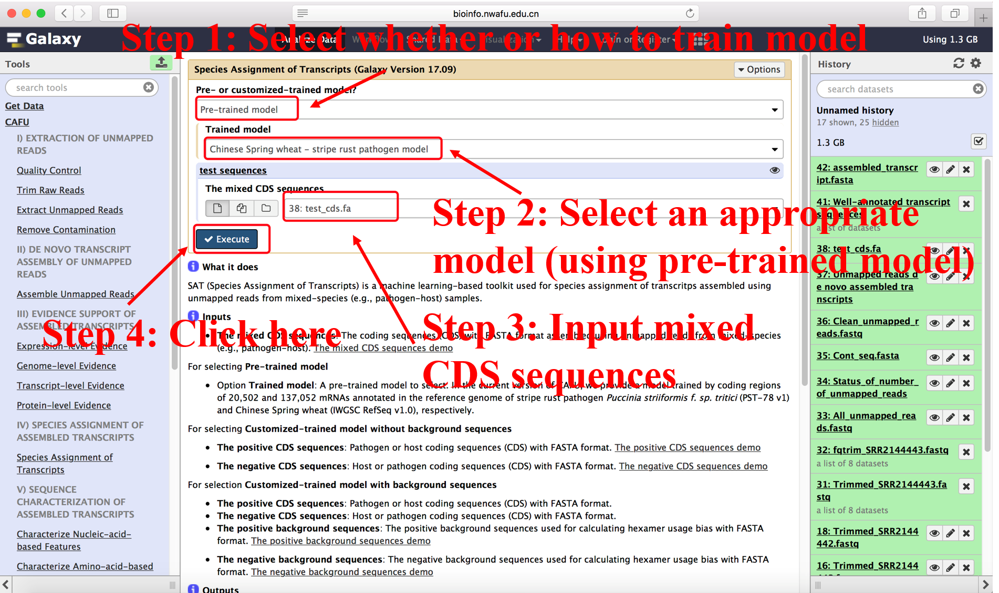

  Then click **Execute** to run this function, then ```Probabilistic score of each transcript``` (a probabilistic score of each transcript, the higher, the more probable being positive.) will be returned (see figure below):
  
  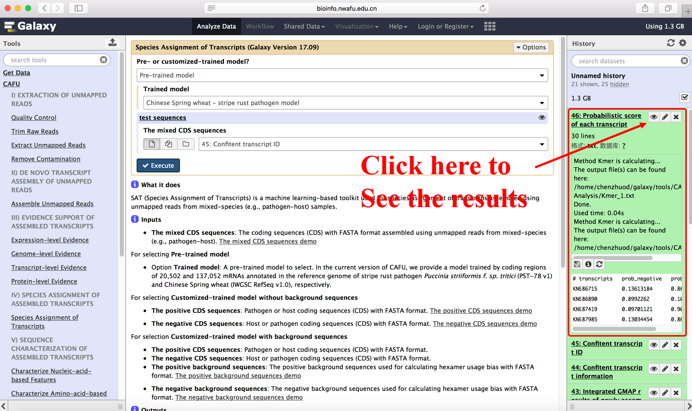
  
  Besides, we also show the way which run SAT by training model using customized data. The test data are also in directory ```/your directory/CAFU/test_data/SAT/```.
  
  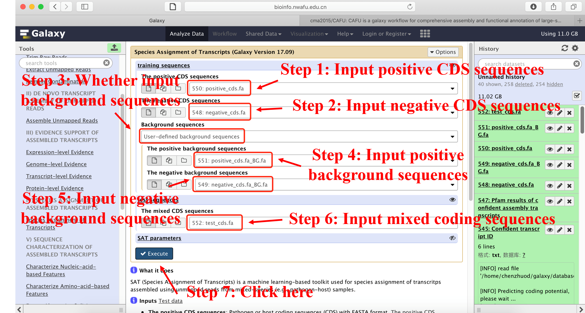
  
  Then click **Execute** to run this function, then ```Probabilistic score of each transcript``` (a probabilistic score of each transcript, the higher, the more probable being positive), ```Model``` (a model trained by customized sequences), ```Eight commonly used measures under different threshold``` (a bar plot evaluating the measures (Sn, Sp, Pr, Acc, MCC, Fscore, AUC and AUPR) under specified threshold), ```The presicion recall curves in k-fold cross validation``` (a PR curve in k-fold cross-validation), and ```The receiver operating curves in k-fold cross validation``` (an ROC curve in k-fold cross-validation) will be returned (see figure below):
  
  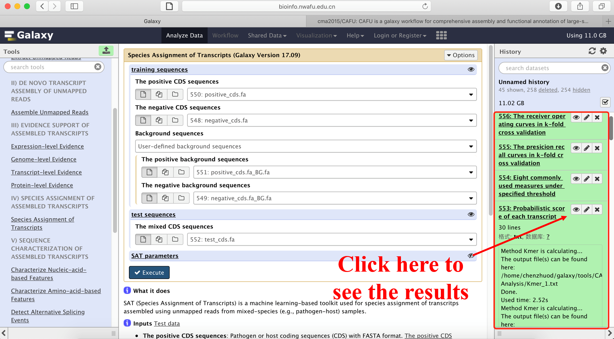

### SEQUENCE CHARACTERIZATION OF ASSEMBLED TRANSCRIPTS

- **Characterize Nucleic-acid Feature**

  This function allows users to characterize the nucleic-acid-based features between assembled and reference transcripts in terms of transcript length and GC content

  To run this function, two inputs are required including:

  **Input 1**: Assembled transcript sequences generated from the function Assemble Unmapped Reads. Test data (```assembled_transcript.fasta```) is in directory ```/your directory/CAFU/test_data/others/```.
  
  **Input 2**: The sequences of transcripts from the existing genome annotation. Test data (```ref_trans.fasta.zip```) is in directory ```/your directory/CAFU/test_data/Transcripts/```.

  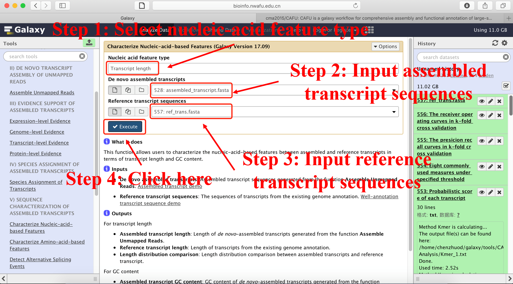

  Then three outputs will be returned:
  
  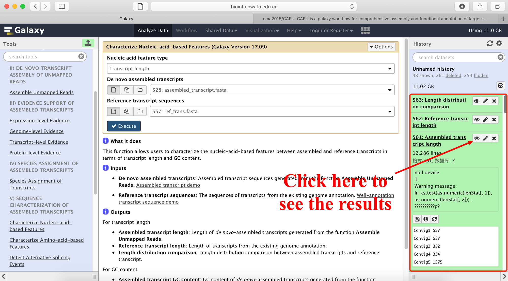

  - **For Transcript length**

    ```Assembled transcript length```, Length of *de novo*-assembled transcripts generated from the function Assemble Unmapped Reads.
    
    ```Reference transcript length```, Length of transcripts from the existing genome annotation.

    ```Length distribution comparison```, Length distribution comparison between assembled transcripts and reference transcript.

  - **For GC content**

    ```Assembled transcript GC content```, GC content of *de novo*-assembled transcripts generated from the function Assemble Unmapped Reads.

    ```Reference transcript GC content```, GC content of transcripts from the existing genome annotation.

    ```Length distribution comparison```, GC content distribution comparison between assembled transcripts and reference transcript.


- **Characterize Amino-acid Feature**

  This function allows users to characterize the amino-acid-based features implemented in BioSeq-Analysis (Liu *et al*., 2017) between assembled and reference transcripts.

  Here, we take an example (see figure below) to show how to use this function to compare k-mer frequency of assembled and reference transcripts.
  
  **Input 1**: Assembled transcript sequences generated from the function Assemble Unmapped Reads. Test data (```assembled_transcript.fasta```) is in directory ```/your directory/CAFU/test_data/others/```.
  
  **Input 2**: The sequences of transcripts from the existing genome annotation. Test data (```ref_trans.fasta.zip```) is in directory ```/your directory/CAFU/test_data/Transcripts/```.

  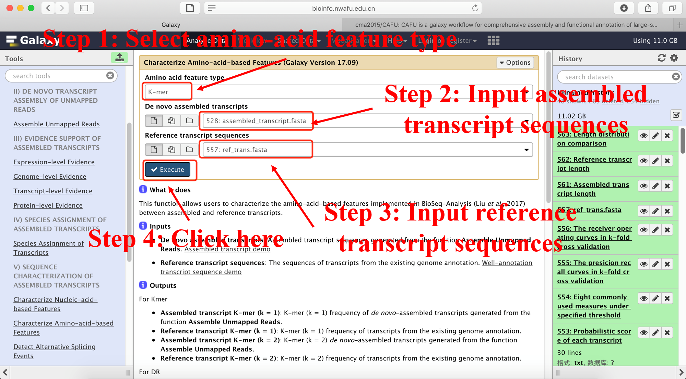
  
  **Note**: The detailed feature descriptions are available at http:/bioinformatics.hitsz.edu.cn/BioSeq-Analysis/
  
  The outputs contain (see figure below):
  
  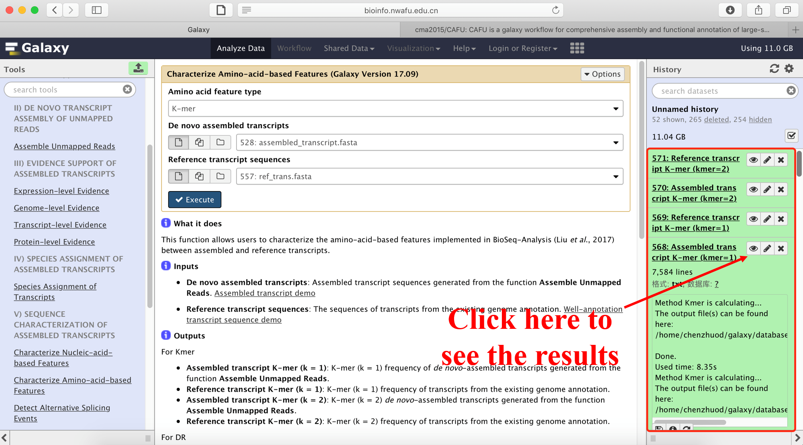
  
  ```Assembled transcript K-mer (k = 1)```, K-mer (k = 1) frequency of de novo-assembled transcripts generated from the function **Assemble Unmapped Reads**.

  ```Reference transcript K-mer (k = 1)```, K-mer (k = 1) frequency of transcripts from the existing genome annotation.

  ```Assembled transcript K-mer (k = 2)```, K-mer (k = 2) de novo-assembled transcripts generated from the function **Assemble Unmapped Reads**.
    
  ```Reference transcript K-mer (k = 2)```, K-mer (k = 2) frequency of transcripts from the existing genome annotation.

- **Detect Alternative Splicing Events**

  This function is used to detect alternative splicing events in assembled transcripts using an R package SGSeq (Goldstein *et al*., 2016).

  The only input of this function is GFF/GTF annotation file, here we use the test data ```AS_test.gtf.zip``` located in ```/your directory/CAFU/test_data/others/``` to run this function.

  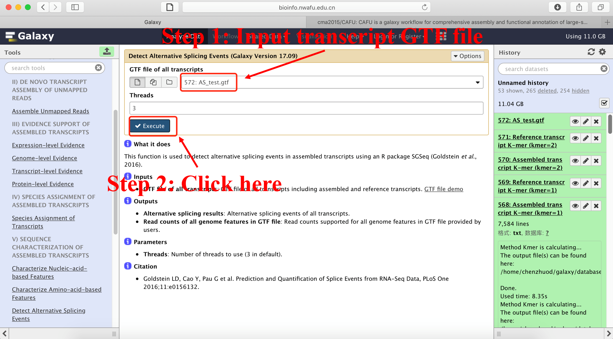

  Then two outputs will be returned (see figure below):
  
  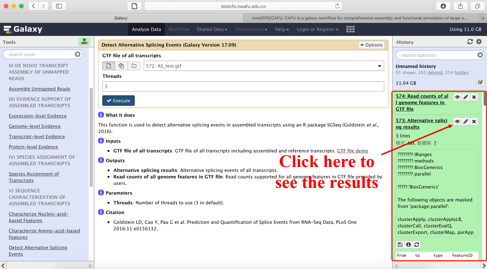

  **Output 1**: ```Alternative splicing results```, Alternative splicing events of all transcripts.

  **Output 2**: ```Read counts of all genome features in GTF file```, Read counts supported for all genome features in GTF file provided by users. 

### EXPRESSION PROFILES OF ASSEMBLED TRANSCRIPTS
- **Analyze Condition Specificity**

  This function identifies a set of transcripts highly expressed under different conditions. The condition specificity of a transcript is defined using the formula described in (Ma *et al*., 2014).

  Here, we use the test data ```assembled_transcript_expression, RNA-Seq_sample_information``` in the folder ```/your directory/CAFU/test_data/others/``` to show its usage (see figure below).

  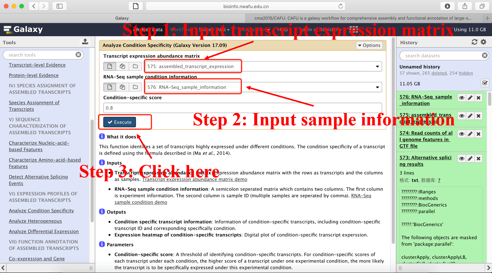

   Then two outputs will be returned (see figure below):
   
   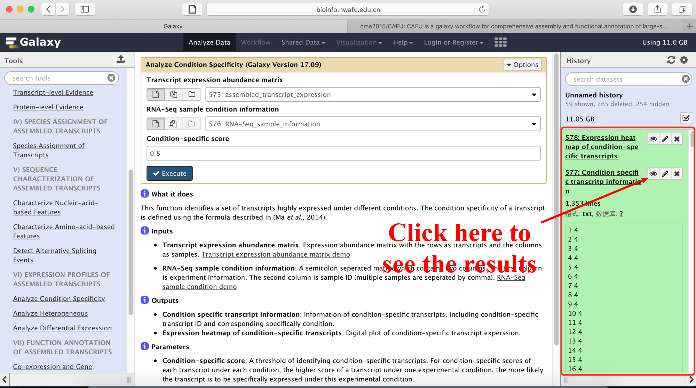

   ```Condition specific transcript information```, Information of condition-specific transcripts, including condition-specific transcript ID and corresponding specifically condition.

   ```Expression heatmap condition-specific transcritps```, Digital plot of condition-specific transcript expression.

- **Analyze Heterogeneous**

  This function examines the stability of each transcript using its expression values in all samples by the Gini index (coefficient) according to (O'Hagan *et al*., 2017).

  To run this function, the only required input is the ```Transcript expression abundance matrix```, which is a tab seperated expression abundance matrix with the rows as transcripts and the columns as samples. Here, we still use the sample data ```assembled_transcript_expression``` in the folder ```/your directory/CAFU/test_data/others/``` to show its usage (see figure below).

  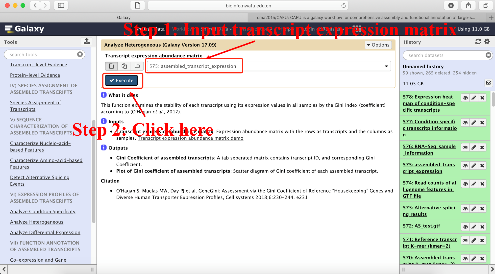

  The two outputs will be returned (see figure below):
  
  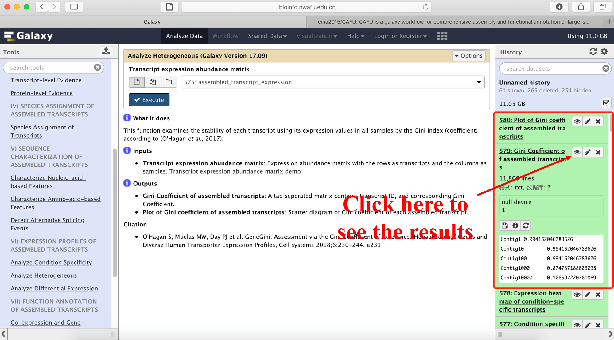

  **Output 1**: ```Gini Coefficient of assembled transcripts```, A tab seperated matrix contains transcript ID, and corresponding Gini Coefficient.

  **Output 2**: ```Plot of Gini coefficient of assembled transcripts```, Scatter diagram of Gini coefficient of each assembled transcript.

- **Analyze Differential Expression**

  This function integrates RSEM (Li *et al*., 2011) and EBSeq (Leng *et al*., 2013) to identify differential expression transcripts.
  
  Here, we use the test data ```assembled_transcript.fasta``` in the folder ```/your directory/CAFU/test_data/others/```, and the same collection (```SE-RNA-Seq```) with **Quality control** to show its usage (see figure below). RNA-Seq sample experiment information ```DE_info``` is in the folder ```/your directory/CAFU/test_data/SE RNA-Seq/```.

 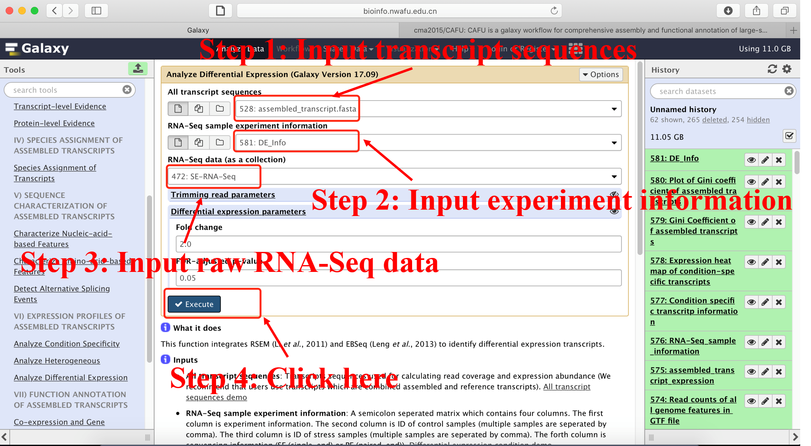 

  Then four outputs will be returned (see figure below):
  
  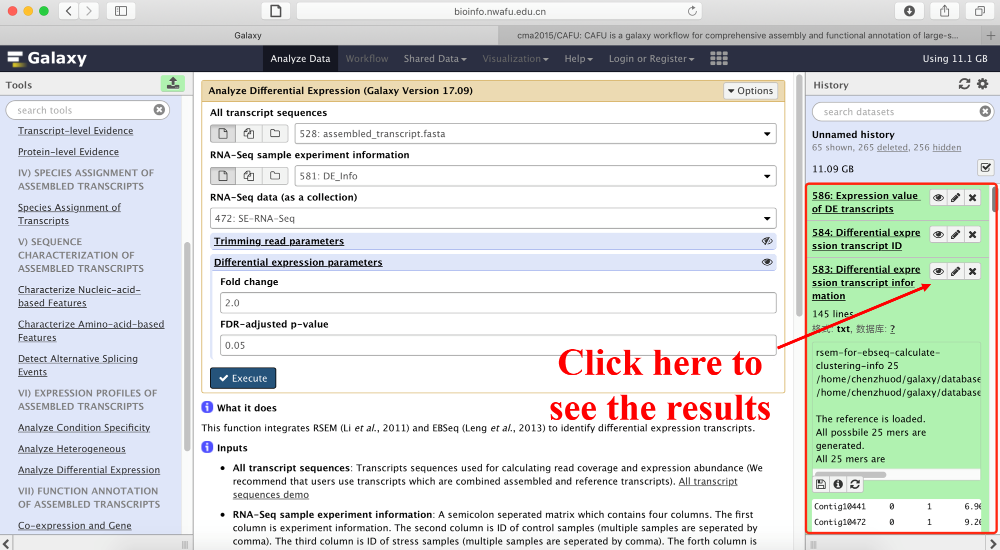 

  ```Differential expression transcript information```, Information of differential expression (DE) transcripts filtered by user-defined criteria, including transcript ID, FDR, fold change, etc.

  ```Differential expression transcript ID```, IDs of DE transcripts filtered by differential expression criteria.

  ```Expression value of DE transcripts```, Expression abundance matrix of **DE transcripts** with the rows as transcripts and the columns as samples.

### FUNCTION ANNOTATION OF ASSEMBLED TRANSCRIPTS

- Co-expression and Gene Ontology Enrichment Analysis

  In this function, co-expression network and GO enrichment analysis are used to annotate transcripts using "WGCNA" and "topGO", respectively.

  In this tutorial, we used the file ```differentially_expressed_transcript_expression``` located in ```/your directory/CAFU/test_data/others/``` to perform co-expression network and GO enrichment analysis (see figure below).
  
  **Note:** (1) For testing this function with the file ```differentially_expressed_transcript_expression``` , the parameter ```Minimum number of expressed samples``` should be set as ```32```;
  
     (2) It is necessary to ensure the computer is connected to the network.

  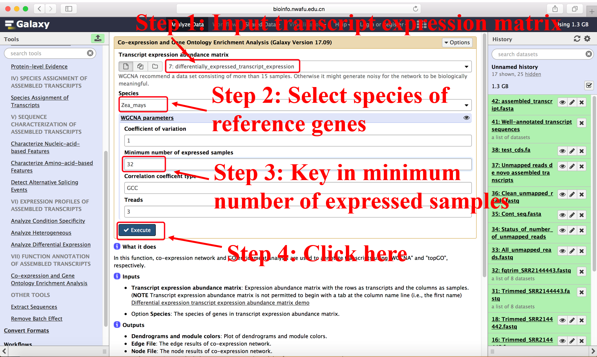

  Then five results will be generated including (see figure below):
  
  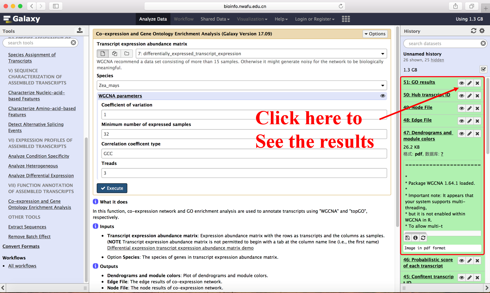

   **Output 1**: ```Dendrograms and module colors```, Plot of dendrograms and module colors.

   **Output 2**: ```Edge File```, The edge results of co-expression network.

   **Output 3**: ```Node File```, The node results of co-expression network.

   **Output 4**: ```Hub transcript ID```, The hub transcript ID in each module of co-expression network.

   **Output 5**: ```GO results```, GO enrichment results of each module.

### OTHER TOOLS

- **Extract Sequences**

  This function is provided for extracting transcript sequences which includes three sub-functions:
  - **Extract user-defined transcript sequences according to sequence ID from a fasta file**: This function can be used for extracting sub-sequences (e.g. novel transcripts) from a fasta file (e.g. assembled transcript sequences) according to user-defined transcript ID (e.g. novel transcript ID).
  - **Extract reference transcript sequences according to GTF/GFF from reference genome sequences**: This function is used for extracting reference transcript sequences from reference genome sequences according to genome annotation file (GTF/GFF).
  - **Build all transcripts (including user-defined and reference transcripts)**:  This function is used for extracting user-defined transcript sequences and reference transcripts, and combining them.

  For **Extract user-defined transcript sequences according to sequence ID from a fasta file**, there are two required inputs including:
  
  **Input 1**: ```All assembled transcript sequences```, This file can be generated from the function **Assemble Unmapped Reads**.
  
  **Input 2**: ```User-defined transcript ID```, IDs of user-defined transcripts. (This file can be generated from the module **iii) Evidence support of assembled transcripts**).
  
  Then the output transcript sequence file named as ```Sequences of user-defined transcripts``` will be returned.
  
  For **Extract reference transcript sequences according to GTF/GFF from reference genome sequences**, there are also two required inputs including:
  
  **Input 1**: ```Reference genome sequence```, Sequences of reference genome including all chromosome.
  
  **Input 2**: ```Reference genome annotation```, Corresponding reference genome annotation file with reference genome.
  
  Then the output transcript sequence file named as ```Sequences of reference transcripts``` will be returned.
  
  For **Build all transcript file (including novel and reference transcripts)**, the input files is the same as the former two ways (see figure below).
  
  
  
  Then the output transcript sequence file named as ```Sequences of all transcripts``` will be returned.
  
  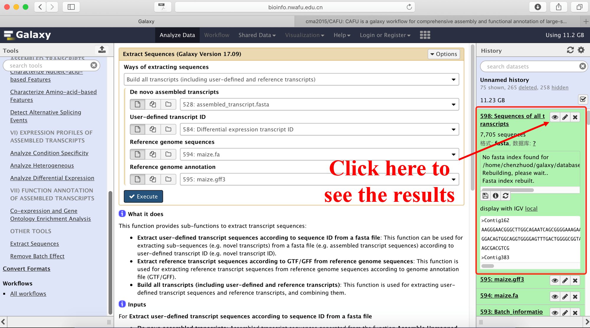
  


- **Remove Batch Effect**

  This function can be used to remove batch effect using an R package sva (Leek *et al*., 2012).

  To run this function, there are two required inputs (see figure below) including:

  **Input 1**: ```assembled_transcript_expression``` in the folder ```/your directory/CAFU/test_data/others/```.

  **Input 2**: RNA-Seq sample batch effect information ```Batch information.zip``` is in the folder ```/your directory/CAFU/test_data/others/```.
  
  - **Expample:** Number 1, 2, 3 represent different experiments. The batch information should be:
    ```bash
    SRR001;1
    SRR002;1
    SRR003;2
    SRR004;3
    SRR005;3
    SRR006;3
    ```

  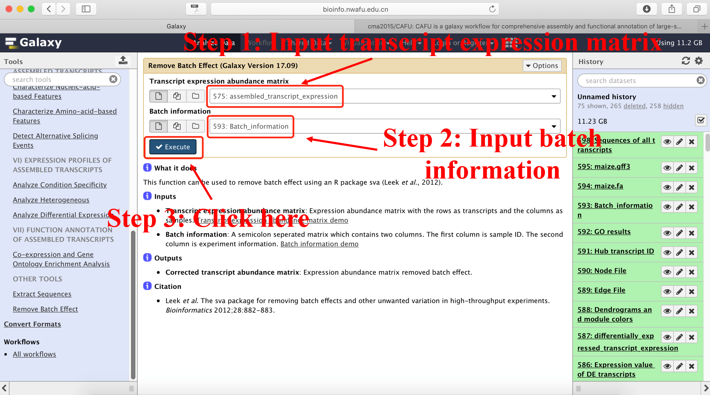

  Then expression abundance matrix removed batch effect named as ```Corrected transcript abundance matrix``` will be returned.
  
  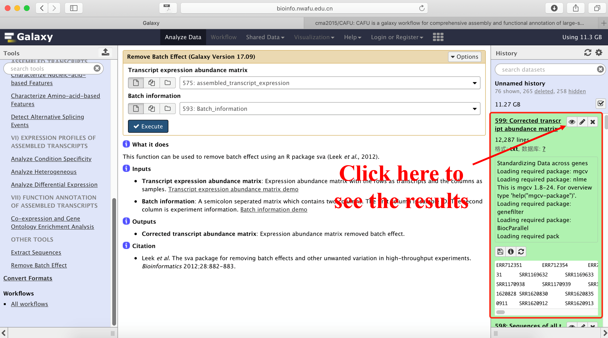

